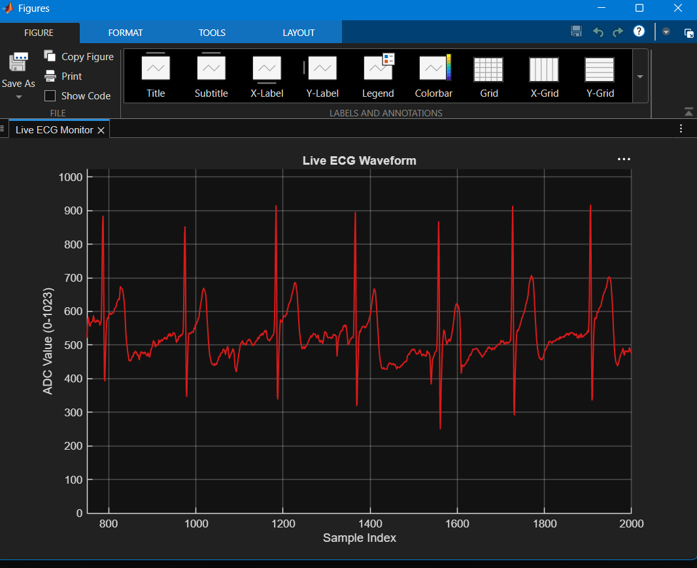

# Real-Time ECG Monitor — PIC24FJ64GA002 + MATLAB

A single-lead ECG monitor: electrodes → analog front-end → PIC24 microcontroller
→ live scrolling waveform in MATLAB, hospital-monitor style.




## Signal Path

```
Electrodes → AD8232 (analog front-end) → PIC24FJ64GA002 (ADC + UART)
           → CP2102 (USB-to-serial) → MATLAB (live plot)
```

## Hardware

- **PIC24FJ64GA002** — samples the signal, transmits over UART
- **AD8232** breakout — analog front-end / amplification
- **Digilent chipKIT PGM** — ICSP programmer
- **CP2102** — USB-to-TTL bridge to the PC
- 3x Ag/AgCl electrodes, breadboard, jumper wires

## Software

- **MPLAB v8.80** + **MPLAB C30** compiler (legacy toolchain, for chipKIT PGM
  compatibility)
- **MATLAB** (R2019b+, uses `serialport`)

## Getting Started

**1. Flash the firmware**
Open `mainV8.c` in MPLAB v8.80 as a Standalone Project (device:
PIC24FJ64GA002, toolsuite: Microchip C30). Set Configuration Bits
(Oscillator = FRC, Watchdog = Disabled, JTAG = Disabled), build, and program
via the chipKIT PGM.

**2. Run the live plot**
Wire the CP2102 (RXD → PIC TX pin, GND → GND), note its COM port in Device
Manager, update `COM_PORT` in `ecg_live_plot.m`, and run it in MATLAB.

## Repository Structure

```
├── mainV8.c                # PIC24 firmware
├── ecg_live_plot.m       # MATLAB live plot script
├── images/
├── TROUBLESHOOTING.md    # Every build issue hit, and how it was fixed
└── README.md
```

## Limitations

Single-lead only, no leads-off detection, built for educational/portfolio
purposes — not a medical device.

## Roadmap

- [ ] Move to a custom PCB (KiCad)
- [ ] Real-time BPM via QRS/peak detection in MATLAB
- [ ] Digital filtering (baseline drift, 50/60Hz notch)

---

Built by Hassan Hanif as a personal biomedical engineering project.
See [`TROUBLESHOOTING.md`](TROUBLESHOOTING.md) for the full debugging log.
